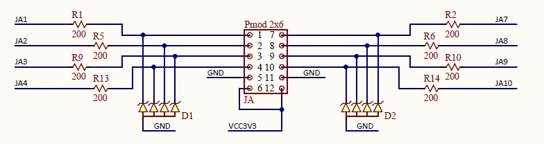
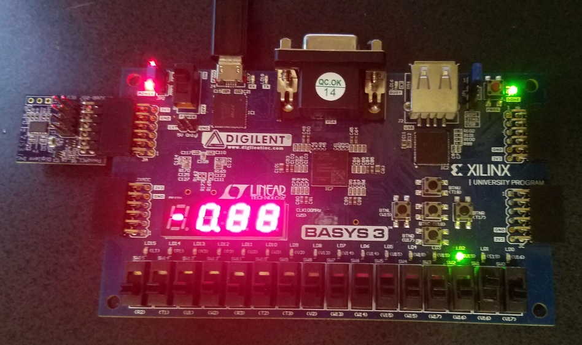

# FPGA Verilog Project: Basys3_Accelerometer_SPI
This project accomplish 3-axis digital accelerometer sensing using the following key components.

- Xilinx artix7
- Xilinx Vivado 2018.4 version
- Basys3 board from Digilent
- [PMod ACL](https://store.digilentinc.com/pmod-acl-3-axis-accelerometer/) module from Digilent (SPI and I2C interface)

Content below is organized in sections of 

- Source code 
- FPGA board constraint and bitstream creation
- Physical connection, and testing

## Source code

Digilent provided a working verilog example at the [source center](https://reference.digilentinc.com/reference/pmod/pmodacl/start?_ga=2.219180313.106783754.1568086945-1004018170.1567308757&_gac=1.144302593.1567308757.EAIaIQobChMImseSiNiu5AIVEv5kCh0QqQDcEAAYASAAEgLsufD_BwE). Though the original target board is Nexys 3 and ISE environment, it is found that the code can be used on Basys 3 board directly without much change. The user can download the original zip file, upgrade the project during the importing of *.xise file. The easy way is to open the "PmodACL_Verilog.xpr" project-file directly using Vivado 2018.4 (or above) in this github repository. 

## FPGA board constraint and bitstream creation

In this project, the Pmod is chosen at the JA, and only 4 pins are used: JA1, JA2, JA3, and JA4.

The corresponding XDC setting is listed below

- set_property PACKAGE_PIN J1 [get_ports SS]
      set_property IOSTANDARD LVCMOS33 [get_ports SS]
- set_property PACKAGE_PIN L2 [get_ports SDO]
      set_property IOSTANDARD LVCMOS33 [get_ports SDO]
- set_property PACKAGE_PIN J2 [get_ports SDI]
      set_property IOSTANDARD LVCMOS33 [get_ports SDI]
- set_property PACKAGE_PIN G2 [get_ports SCLK]
      set_property IOSTANDARD LVCMOS33 [get_ports SCLK]

Reset is connected to the button-up with the setting below

- set_property PACKAGE_PIN T18 [get_ports {RST}]
      set_property IOSTANDARD LVCMOS33 [get_ports {RST}]

Once user choose "Generate Bitstream", a file named "PmodACL_Demo.bit" will be created under the folder "PmodACL_Verilog.runs\impl_1". Though the bit file is provided in this repository, user is encouraged to create his/her own bitstream file.

## Physical connection, testing

The plugin of Pmod ACL is quite straightforward, as shown in the following figure.

As you might expected, after program the board using hardware manager, the accelerometer data could be read on the 7-segment display.

