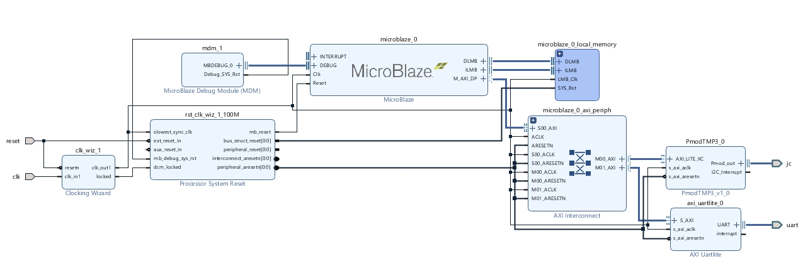

# FPGA Project  Basys3_Temperature_Sensor_I2C

This readme file is to created to explain the steps to follow to accomplish a temperature sensing project using the following items.
- Xilinx artix7
- Xilinx Vivado
- Basys3 board from Digilent
- PMod TMP3 module from digilent (I2C interface)

Content below is organized into sections with the table of 

- IP selection and connection, 
- FPGA board constraint and bitstream creation
- SDK export and firmware integration
- FPGA board and Pmod temperate sensor (TMP3) physical connection, and firmware testing

## IP section and port connection

The final IP block diagram is shown as the following:

The main block/IP contains three parts:

- MicroBlaze
- AXI Uartlite
- PmodTMP3

Port "jc", which is connected to "Pmod_out" of "PmodTMP3_0", is created by drag and drop "Connector JC" from the tab "Board". 

In case the "Board" tab is not shown up in the project, using the following method to add board definition.

## FPGA board constraint and bitstream creation

After the going through the steps of "Create HDL Wrapper", the top level verilog RTL will be created by Vivado. 

- clk
- jc_pin10_io
- jc_pin1_io
- jc_pin2_io
- jc_pin3_io
- jc_pin4_io
- jc_pin7_io
- jc_pin8_io
- jc_pin9_io
- reset
- uart_rxd
- uart_txd

Pin "reset" is assigned to switch SW15 using he constraint below

​	set_property PACKAGE_PIN R2 [get_ports {reset}]
​	set_property IOSTANDARD LVCMOS33 [get_ports {reset}] 

Uart port is assigned to usb-RS232 connection

​	set_property PACKAGE_PIN B18 [get_ports uart_txd]
​    	set_property IOSTANDARD LVCMOS33 [get_ports uart_txd]
​	set_property PACKAGE_PIN A18 [get_ports uart_rxd]
​    	set_property IOSTANDARD LVCMOS33 [get_ports uart_rxd] 

In this project, the I2C is assigned to connector JC, thus the constraint file should be modified as the following:

With the above setup, the "Generate Bitstream" on the left of the window will generate the binary file ready for programing the board.  Make USB connection and follow the steps ("Open Hardware Manager"->"Open target"->"Auto connect"->"Program device") to program the Basys3 board.

## Export hardware, Launch SDK and firmware integration

Take action to do "File->Export->Export Hardware" will create HDF file under the local folder.

Select menu "File->Launch SDK" will bring up the SDK, if the Vivado installation is completed along with the SDK installation.

The firmware for this project is simple and contains only one file "helloworld.c", which is mainly quote the code from the PmodTMP3 "examples".  The "helloworld.c" file can be found at "I2C_ip.sdk\uart_tmp3\src" and it does three things:

- Initialize the TMP3 device through I2C 
- Read register from TMP3 device through I2C
- Cleanup the project

## FPGA board and Pmod temperate sensor (TMP3) physical connection, and firmware testing

Vivado SDK will compile and put the "elf" file under the folder "\I2C_ip.sdk\uart_tmp3\Debug". 

Before launch the application using "Run As" -> "Launch on Hardware (System Debug)". Physical connection of TMP3 needs to be made. I2C only needs SCL and SDA for data connection and, in this project, they are connected to JC3 and JC4. Power could be connected to JC6, and ground could be connected to JC5.

The physical connection could be viewed in the following figure.

Once everything is ready, launch the application and Tera-Term, the temperature reading could be found on the serial terminal.

Don't forget that, as a user, you can use physical switch to reset (start/stop) the temperature reading.