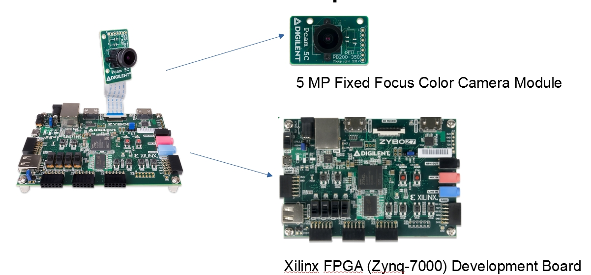
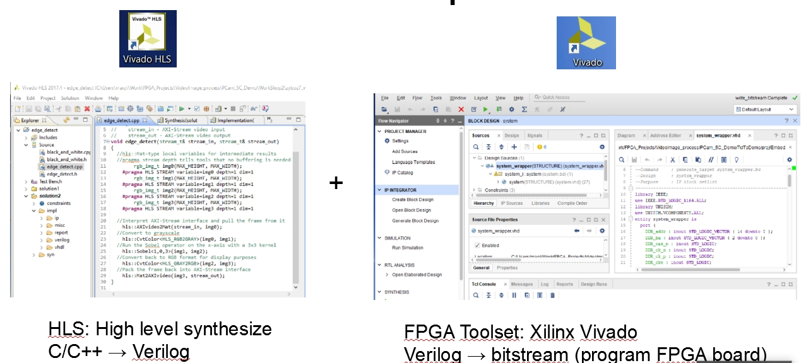
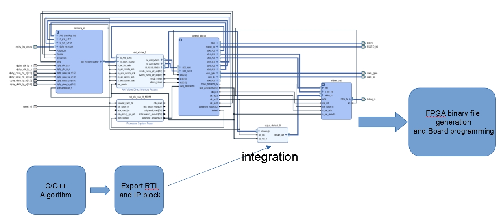
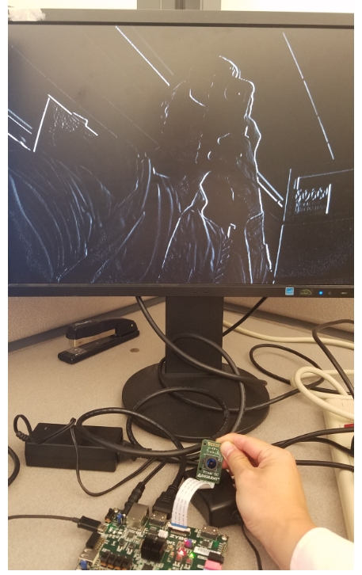
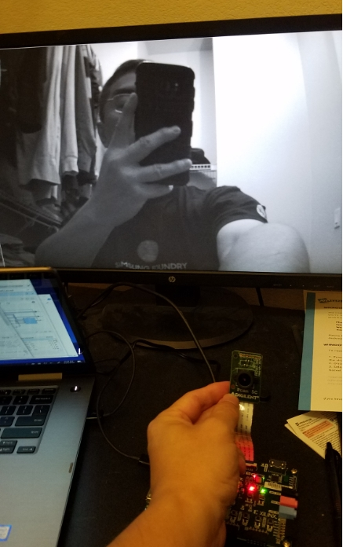

# FPGA Project: Zebo Z7_Camera_MIPI, computer vision
This project accomplish 3-axis digital accelerometer sensing using the following key components.

- Xilinx zynq-7000
- Xilinx Vivado 2017.4 version
- [Zybo Z7](https://store.digilentinc.com/zybo-z7-zynq-7000-arm-fpga-soc-development-board/) from Digilent
- [PCam 5C](https://store.digilentinc.com/pcam-5c-5-mp-fixed-focus-color-camera-module/) module from Digilent (MIPI CSI-2 interface)

Software Preparation

- Vivado 2017.4
- Vivado HLS 2017.4

Content below is organized in sections of 

- Design Steps 
- Testing and results

## Design Steps

Digilent provided a workshop example at the [source center](https://reference.digilentinc.com/reference/add-ons/pcam-5c/start?_ga=2.205176472.987722862.1569092148-1004018170.1567308757&_gac=1.249678514.1567308757.EAIaIQobChMImseSiNiu5AIVEv5kCh0QqQDcEAAYASAAEgLsufD_BwE) of PCam 5C. You need to scroll down to the bottom of the web page to download the workshop file. The instruction "workbook.pdf " is included in this repository. 

To save the repository space, only a small portion of the project is saved on Github. However, user can use the tcl command to recreate the whole project. The start point is the tcl file "create_project.tcl" under "vivado_project\proj".  Tcl command-line can be used to launch this script.

It is noticed that recreating the whole project in Vivado 2018.4 (and later version) is not successful. Thus, it is recommended that Vivado 2017.4 should be downloaded, installed and launched for this project. Though the default top-level wrapper is in VHDL, it is believed that verilog should also function correctly.

Besides Vivado, another critical piece in this project is to launch the HLS tool and compose the "Edge-detect" function in C language and export the RTL and IP. The challenge for this task is not the C function itself but the understanding the library provided by Xilinx and the multiple "directive" applied in the setting. To gain the knowledge of library and "directive", "[ug902-vivado-high-level-synthesis.pdf](https://www.xilinx.com/support/documentation/sw_manuals/xilinx2017_4/ug902-vivado-high-level-synthesis.pdf)" is the resource to search for the details.

## Testing and results

Once the connection with hardware is made and SDK correctly is launched, the result is amazing. The following figure shows the result of applying an edge-detect on the system.

## Testing and results2 

With a little bit tuning and apply new Black and white filter, the result of seeing black-and-white picture/video is shown below.

